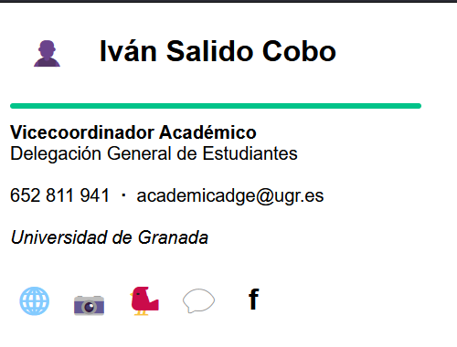

# Generador de firmas para el correo

Este script de Python permite generar las firmas para el correo siguiendo un archivo de configuración correspondiente a la entidad para la que es la firma (que incluye cosas como fuentes y colores) y otro archivo con los datos de las personas para las que generar la firma.

Aquí también se guardarán todas las firmas HTML que vaya haciendo para los correos electrónicos, principalmente para:

- [Delegación de Estudiantes de la Facultad de Ciencias (DEFC)](https://defc.ugr.es)
- [Delegación General de Estudiantes (DGE)](https://dge.ugr.es)
- [Asociación de Estudiantes de Matemáticas y Estadística de la UGR (AMAT)](https://amatugr.es)
- [Coordinadora de Representantes de Estudiantes de Universidades Públicas (CREUP)](https://www.creup.es)
- [XXVI Encuentro Nacional de Estudiantes de Matemáticas (ENEM)](https://enem.anem.es/2025)

Las firmas partieron de una base que supongo que será de @jesusjmma y, actualmente, utilizan iconos de [Tabler Icons](https://tabler-icons.io)

---

## Características

- ✅ Generación de firmas HTML a partir de plantillas Jinja2
- ✅ Soporte para múltiples configuraciones de organizaciones
- ✅ Validación de datos CSV y configuración JSON
- ✅ CLI con argumentos para automatización
- ✅ Previsualización de firmas generadas
- ✅ Compatibilidad mejorada con clientes de correo (uso de tablas HTML)
- ✅ Macros reutilizables para componentes comunes

---

## Ejemplos de firmas

A continuación hay unas capturas de cómo se deberían de ver las firmas.

### Ejemplo de firma de la DEFC

Cuando los iconos cargan, la firma se debería de ver así:


Y cuando no cargan, así:


### Ejemplo de firma de la DGE

Cuando los iconos cargan, la firma se debería de ver así:


Y cuando no cargan, así:



### Ejemplo de firma de AMAT

Cuando los iconos cargan, la firma se debería de ver así:


Y cuando no cargan, así:


### Ejemplo de firma de CREUP

Cuando los iconos cargan, la firma se debería de ver así:


Y cuando no cargan, así:


### Ejemplo de firma del ENEM

Cuando los iconos cargan, la firma se debería de ver así:


Y cuando no cargan, así:


## Cómo usar las firmas

> [!IMPORTANT]
> Estas instrucciones se revisaron por última vez el 3 de febrero de 2025, es posible que ya no sirvan.

### En Thunderbird

Simplemente hay que irse a la configuración de la cuenta, marcar la casilla de utilizar un archivo como firma y seleccionar el archivo de firma descargado:


### En Gmail

Primero hay que abrir en el navegador el archivo HTML de la firma, seleccionarlo todo con <kbd>Ctrl</kbd> + <kbd>A</kbd> y copiarlo con <kbd>Ctrl</kbd> + <kbd>C</kbd>.

En otra ventana con Gmail, hay que irse a los ajustes, ver todos los ajustes y, en la pestaña «General», al apartado de «Firma». Se crea una firma nueva y, en el campo de texto, se pega la firma con <kbd>Ctrl</kbd> + <kbd>V</kbd>.

No olvidar tampoco cambiar los «Valores predeterminados de firma» a la firma recién creada para que aparezca y guardar los cambios con el botón del final de la página.


### En Webmail

El archivo de firma es un HTML y tiene la siguiente estructura:

```html
<!DOCTYPE html>
<html>
  <head>
    <meta http-equiv="Content-Type" content="text/html; charset=UTF-8" />
    <title></title>
  </head>
  <body>
    <div>...</div>
  </body>
</html>
```

Pues para webmail recomiendo solo copiar la parte de

```html
<div>...</div>
```

Y pegarla en el apartado de configuración de Webmail, en «Identidades», dándole al botón que hay más a la derecha que parece `< >`. Este botón es para editar la firma como HTML. Se abrirá una ventana donde hay que pegar el código copiado, sustituyendo todo lo que hubiera antes.


**¿Por qué la recomendación de copiar solo esa parte de la firma HTML?**

Simplemente porque pegando todo el contenido del archivo se pone un espacio en blanco al principio de la firma y es molesto eliminarlo manualmente.

## Cómo usar el script

Para generar firmas, primero hay que clonar o descargar este repositorio y tener instalado [uv](https://github.com/astral-sh/uv).

### Uso básico

```bash
# Modo interactivo (por defecto)
uv run main.py

# Especificar archivo de configuración
uv run main.py -c signatures.json

# Seleccionar perfil por ID (sin interacción)
uv run main.py -p ENEM

# Especificar archivo CSV de firmas
uv run main.py -l mis_firmas.csv

# Generar índice de previsualización
uv run main.py --preview

# Modo verbose (más información)
uv run main.py -v

# Modo silencioso (solo errores)
uv run main.py -q

# Combinar opciones
uv run main.py -c config.json -p CREUP -l firmas.csv --preview
```

### Opciones de línea de comandos

| Opción            | Descripción                                                        |
| ----------------- | ------------------------------------------------------------------ |
| `-c`, `--config`  | Archivo JSON de configuración (por defecto: `signatures.json`)     |
| `-p`, `--profile` | Seleccionar automáticamente el perfil con el ID especificado       |
| `-l`, `--list`    | Archivo CSV con la lista de firmas                                 |
| `--preview`       | Generar un `index.html` con todas las firmas para previsualización |
| `-v`, `--verbose` | Mostrar información detallada                                      |
| `-q`, `--quiet`   | Modo silencioso (solo errores)                                     |

### Configuración (`signatures.json`)

Lo primero que debes hacer es asegurarte de que tienes definida la configuración del tipo de firma en el archivo `signatures.json`. El archivo debe de seguir la siguiente estructura:

```json
[
  {
    "id": "EJEMPLO",
    "template": "original",
    "output_path": "EJEMPLO",
    "main_font": "Montserrat",
    "name_font": "Open Sans",
    "name_image": "https://example.com/logo.png",
    "color": "#3EB1C8",
    "organization": "Mi Organización",
    "organization_extra": "Entidad Superior (opcional)",
    "phone": "123 456 789",
    "phone_country_code": "+34",
    "internal_phone": "12345",
    "opt_mail": "info@ejemplo.es",
    "max_width": 315,
    "links": [
      {
        "url": "https://ejemplo.es",
        "image": "https://example.com/web-icon.png",
        "alt": "🌐"
      }
    ],
    "sponsor_text": "Con la colaboración de:",
    "sponsors": [
      {
        "url": "https://sponsor.com",
        "image": "https://sponsor.com/logo.png",
        "alt": "Sponsor",
        "width": 100,
        "height": 50
      }
    ],
    "supporter_text": "Con el apoyo de:",
    "supporters": [
      {
        "url": "https://supporter.com",
        "image": "https://supporter.com/logo.png",
        "alt": "Supporter",
        "height": 55
      }
    ],
    "footer_address": "Calle Ejemplo, 123, 12345 Ciudad",
    "footer_text": "Texto legal opcional..."
  }
]
```

### Campos de configuración

| Campo                | Obligatorio | Descripción                                       |
| -------------------- | ----------- | ------------------------------------------------- |
| `id`                 | ✅           | Identificador de la configuración                 |
| `template`           | ✅           | Plantilla a usar: `original` o `wide-logo`        |
| `output_path`        | ❌           | Carpeta de salida (por defecto usa `id`)          |
| `main_font`          | ✅           | Fuente principal del texto                        |
| `name_font`          | ✅           | Fuente del nombre de la persona                   |
| `name_image`         | ✅           | URL de la imagen/logo (debe ser una URL válida)   |
| `color`              | ✅           | Color hexadecimal (ej: `#3EB1C8`)                 |
| `organization`       | ✅           | Nombre de la organización                         |
| `organization_extra` | ❌           | Organización superior/adicional                   |
| `phone`              | ❌           | Número de teléfono (sin código de país)           |
| `phone_country_code` | ❌           | Código de país (ej: `+34`)                        |
| `internal_phone`     | ❌           | Extensión interna                                 |
| `opt_mail`           | ❌           | Email alternativo (se muestra si no hay teléfono) |
| `max_width`          | ❌           | Ancho máximo en píxeles                           |
| `links`              | ❌           | Lista de enlaces sociales                         |
| `sponsor_text`       | ❌           | Texto sobre los patrocinadores                    |
| `sponsors`           | ❌           | Lista de patrocinadores                           |
| `supporter_text`     | ❌           | Texto sobre los colaboradores                     |
| `supporters`         | ❌           | Lista de colaboradores                            |
| `footer_address`     | ❌           | Dirección postal                                  |
| `footer_text`        | ❌           | Texto legal del footer                            |

### Plantillas disponibles

| Plantilla   | Descripción                                                |
| ----------- | ---------------------------------------------------------- |
| `original`  | Diseño clásico con imagen circular y barra horizontal      |
| `wide-logo` | Logo ancho arriba con barra vertical al lado del contenido |

### Lista de firmas (CSV)

Una vez esté la configuración definida hay que crear la lista de firmas a generar, que es un archivo CSV (por defecto `{id}_list.csv`).

#### Columnas obligatorias

```csv
name,position,mail
```

#### Columnas opcionales

Estas columnas, si tienen valor, sobrescriben la configuración general:

```csv
output,phone,phone_country_code,internal_phone,opt_mail,organization_extra,main_font,name_font,max_width,name_image,color,organization
```

> **Nota:** Usa `None` en una celda para eliminar un valor opcional de la configuración general para esa firma específica.

#### Ejemplo de CSV

```csv
Name,Position,Mail,Output,Phone,internal_phone
Ana García,Presidenta,presidencia@ejemplo.es,Firma Presidenta,123 456 789,12345
Juan López,Secretario,secretaria@ejemplo.es,Firma Secretario,,None
```

## Clientes de correo soportados

Las firmas ahora usan tablas HTML en lugar de flexbox para mejorar la compatibilidad con clientes de correo. Las pruebas no han sido muy exhaustivas, pero la firma en algunos sitios va bien :green_circle:, regulinchi _(se ve bien en general pero puede fallar en algún detalle)_ :yellow_circle: y mal :red_circle:. Esta es la lista:

:green_circle: Webmail

:green_circle: Thunderbird

:green_circle: Outlook web

:green_circle: Outlook móvil

:green_circle: Gmail web

:green_circle: Gmail móvil

:yellow_circle: Thunderbird móvil

:red_circle: Canary Mail

## Estructura del proyecto

```
mail-signatures/
├── main.py              # Script principal
├── schemas.py           # Validación de datos
├── signatures.json      # Configuración de organizaciones
├── *_list.csv           # Listas de firmas por organización
├── templates/
│   ├── _macros.html.j2  # Macros reutilizables
│   ├── _base.html.j2    # Plantilla base (opcional)
│   ├── original.html.j2 # Plantilla clásica
│   └── wide-logo.html.j2# Plantilla con logo ancho
└── {OUTPUT}/            # Firmas generadas por organización
```

## Desarrollo

### Crear una nueva plantilla

1. Crea un archivo `templates/mi-plantilla.html.j2`
2. Importa los macros: ``
3. Usa los macros para los componentes comunes
4. Añade el nombre `mi-plantilla` en el campo `template` de la configuración

### Macros disponibles

| Macro                                                                     | Descripción                           |
| ------------------------------------------------------------------------- | ------------------------------------- |
| `social_link(link, size)`                                                 | Renderiza un enlace social individual |
| `social_links_bar(links, size, max_width)`                                | Barra de enlaces sociales             |
| `sponsor_image(item, max_width)`                                          | Imagen de sponsor/supporter           |
| `sponsors_section(text, items, color, max_width, with_bar)`               | Sección completa de sponsors          |
| `footer(footer_address, footer_text, color, max_width)`                   | Footer con dirección y texto legal    |
| `contact_info(phone, phone_country_code, internal_phone, mail, opt_mail)` | Información de contacto               |
| `name_image_block(name_image, organization, size, rounded, wide)`         | Bloque de imagen/avatar con nombre    |
